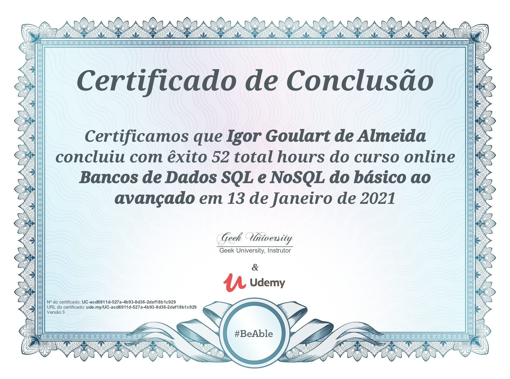

# curso-de-banco-de-dados
> Meus arquivos do curso de bancos de dados relacionais e não relacionais: MySQL, PostgreSQL, SQLite, MongoDB, Modelagem de Dados da [Geek University](https://www.geekuniversity.com.br/), com duração total de 52 horas.

## Tópicos Abordados

- Modelagem de bancos de dados relacionais;
- Esquemas complexos de banco de dados;
- Aplicação das formas normais para validar modelos de dado;
- Detalhes da sintaxe SQL;
- Funções agregadas;
- Consultas complexas usando operadores lógicos e funções;
- Banco de dados relacionais: MySQL, PostgreSQL e SQLite;
- Banco de dados não relacionais: MongoDB, CouchDB, Redis e Firebase;
- 14 aplicações CRUD (Create, Retrieve, Update e Delete) com Python, Java e todos os banco de dados estudados.
